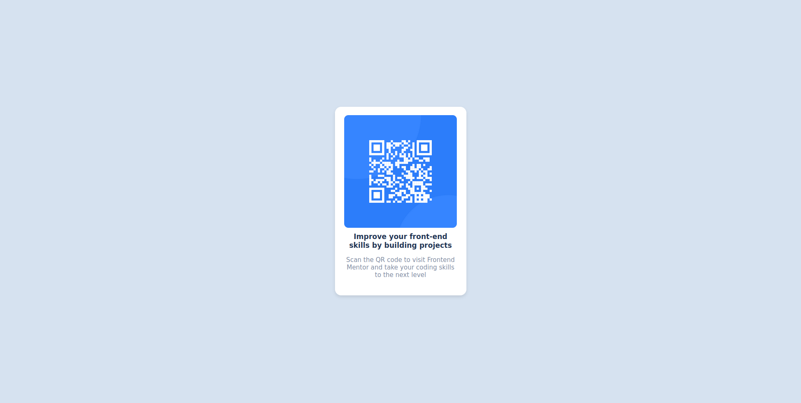

# Frontend Mentor - QR code component solution

This is a solution to the [QR code component challenge on Frontend Mentor](https://www.frontendmentor.io/challenges/qr-code-component-iux_sIO_H). Frontend Mentor challenges help you improve your coding skills by building realistic projects. 

## Table of contents

- [Overview](#overview)
  - [Screenshot](#screenshot)
  - [Built with](#built-with)
  - [What I learned](#what-i-learned)
  - [Useful resources](#useful-resources)
- [Author](#author)


## Overview

### Screenshot




### Built with

- Semantic HTML5 markup
- CSS custom properties
- Flexbox


### What I learned

I learned how to structure my webpage using html, how to use CSS to style my page and the use of FlexBox for better control over the positionning of my divs. I also learned how to make my webpage responsive to the screen size.

This is my first use of a flexbox.

```css
body, html{
    height: 100%;
    margin: 0;
    display: flex;
    justify-content: center;
    align-items: center;
    background-color: hsl(212, 45%, 89%);
    font-family: 'Outfit', sans-serif;
    font-weight: 400; /* Regular weight for body text */
}
```


### Useful resources

- [W3 schools](https://www.w3schools.com/) - This helped me understand the basic syntax of html and css as well as how to link between them. I really liked this pattern and will use it going forward.


## Author

- Github - [EL-ACHAB Aymane](https://www.github.com/elachaba)


